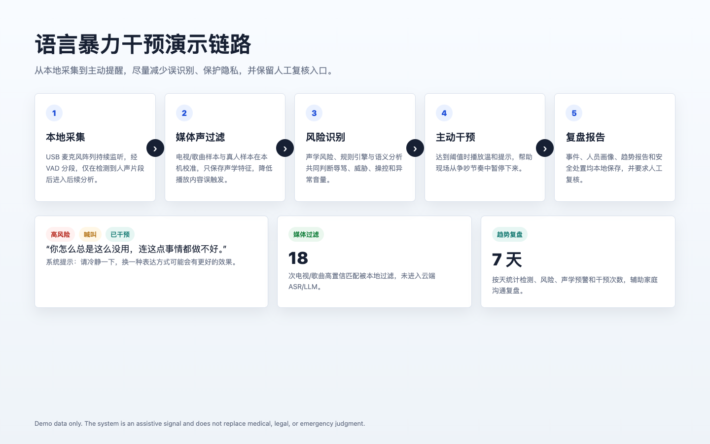
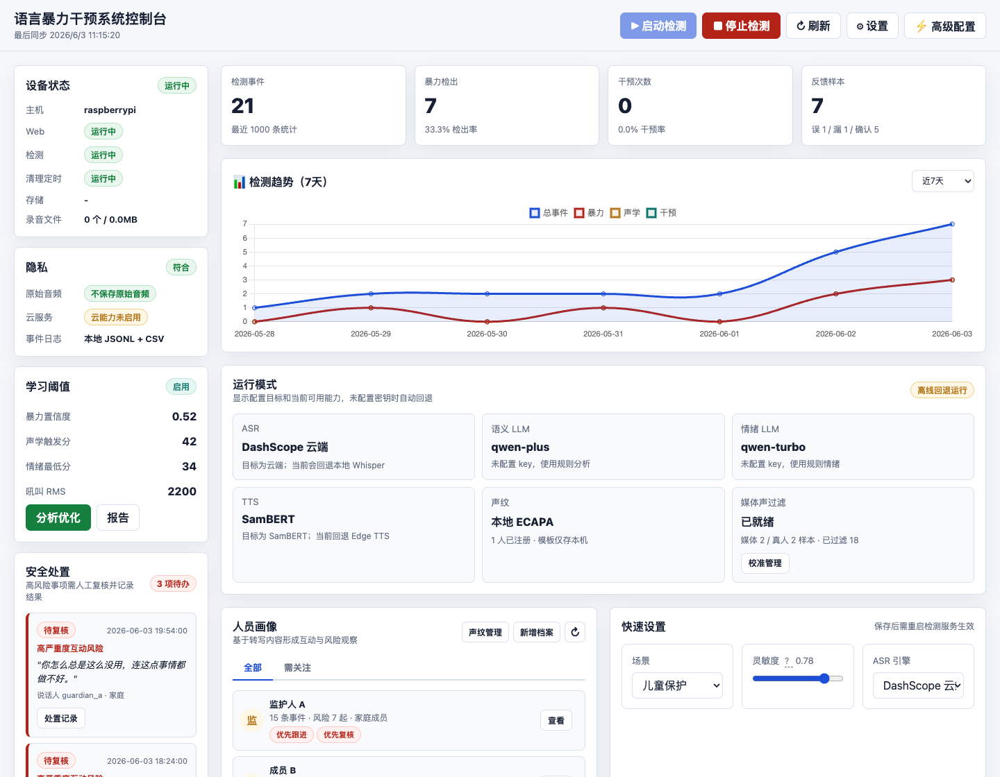
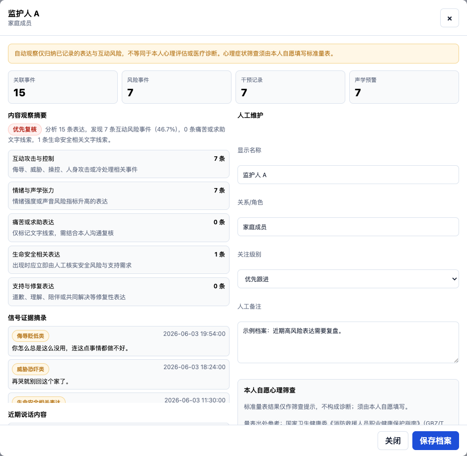
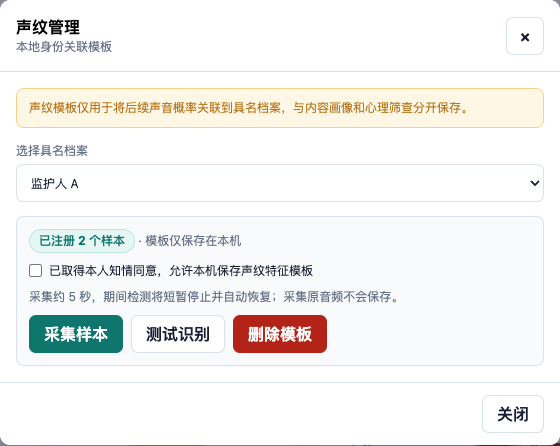
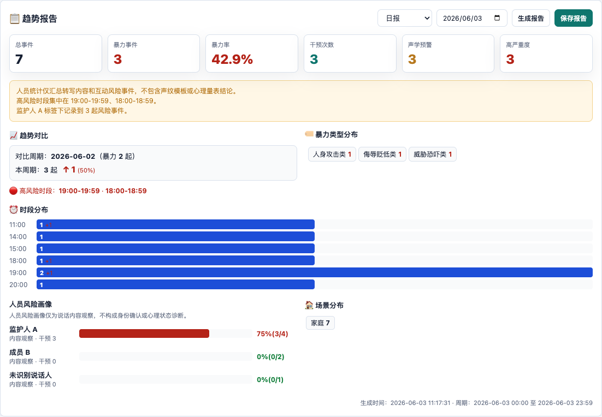

# Language Violence Intervention System

# 语言暴力干预系统

A privacy-first edge AI system for verbal abuse detection and gentle
intervention.

It runs on Raspberry Pi 5, Mac Mini, or a regular x86_64 PC. The system uses
local speech recognition, acoustic risk analysis, rule-based pre-checks, LLM
semantic analysis, and a protected Web console to detect high-risk
communication, trigger non-aggressive reminders, keep local records, and
support human review.

> This project is not a medical diagnostic tool, legal evidence system, or
> emergency response substitute. All outputs are assistive signals and must keep
> room for human judgment.

Language: [Chinese](README.md) | [English](README_EN.md)

Quick links: [Screenshots](#screenshots-and-demo) · [Quick install](#quick-install) · [Raspberry Pi deployment](#raspberry-pi-5-deployment) · [Roadmap](ROADMAP.md) · [License](#license)

## 30-Second Overview

- **What it is**: An edge-side prototype for verbal abuse detection, gentle
  reminders, and human review.
- **What it does**: Detects high-risk expression, acoustic anomalies, and trend
  changes, then can play non-aggressive TTS reminders.
- **Where it runs**: Raspberry Pi 5, Mac Mini, generic x86_64 PC, with
  migration guidance for other ARM boards.
- **Privacy posture**: Raw recordings are not saved by default. Event logs,
  voiceprint templates, speaker profiles, screening summaries, and safety-case
  records are stored locally.
- **Current stage**: `v0.1.0-alpha` prototype. Core WebUI, deployment scripts,
  voiceprint management, media filtering, and trend reporting are implemented,
  while real-world false-positive evaluation is still needed.

## Core Highlights

- **Local-first**: Raw audio is not persisted by default, and local Whisper
  transcription is supported.
- **Active intervention**: High-risk expression can trigger gentle voice
  prompts.
- **Dual detection**: Rule engine for fast pre-checks plus LLM semantic
  analysis when configured.
- **Web console**: Events, trends, speaker profiles, voiceprint management,
  media filtering, and safety-case review.
- **Raspberry Pi deployment**: Raspberry Pi 5 long-running deployment with
  systemd service scripts.
- **Privacy protection**: Logs, voiceprint templates, screening summaries, and
  safety-case records are stored as local private files.

## Overview

This project implements a prototype language-violence detection and active
intervention system designed to run continuously on Raspberry Pi 5. It provides
a local detection service and a protected Web management console. The intended
positioning is a privacy-first family-safety / verbal-abuse detection / edge AI
prototype, not a household surveillance, control, legal evidence, or mental
diagnosis tool.

## Background

Not all harm comes from a single intense conflict. Many forms of harm are built
through repeated negation, humiliation, threats, sarcasm, silent treatment, and
uncontrolled verbal expression. Family relationships are frequent, long-term,
and emotionally close. A person's sense of safety, self-evaluation, stress
level, and emotional regulation can be shaped by everyday interaction patterns
over time.

Language violence is often hidden. It may leave no direct physical evidence,
and it may be explained away as "bad temper", "family matters", or "just harsh
words". However, sustained aggressive communication can reshape how family
members interact, keep victims in long-term tension and self-doubt, and expose
children or adolescents to unhealthy conflict patterns during important stages
of development.

The purpose of this project is to help high-risk language interaction in the
home become visible earlier: observe, record, remind, and interrupt. The system
does not replace psychological counseling, medical diagnosis, legal judgment,
or emergency response. It is an edge-side assistive tool that can help family
members, caregivers, or researchers identify repeated aggressive communication,
observe trends, and provide timely reminders and human-review entry points when
risk rises.

## Intended Effects

The Language Violence Intervention System is designed for family, partner
communication, education, companionship, and child-protection scenarios. It
captures ambient speech through a microphone, performs local speech
segmentation, transcription, acoustic risk analysis, and semantic risk
detection. When high-risk expression or abnormal acoustic signals are detected,
the system can play a gentle intervention prompt and write the event to
protected local logs.

Expected effects include:

- **Earlier risk discovery**: Continuously observe insults, threats,
  belittling, emotional manipulation, silent-treatment cues, and other
  high-risk expressions.
- **Immediate escalation interruption**: Play non-aggressive prompt messages
  during conflict escalation so people can pause before the interaction
  continues automatically.
- **Review and improvement support**: Use event lists, trend reports, and human
  annotations to review when, how often, and under what context high-risk
  interaction appears.
- **Privacy protection**: Raw recordings are not saved by default. Voiceprint
  templates, speaker profiles, screening summaries, and safety-case records are
  stored locally and separated from content observation.
- **Lower false triggers and resource waste**: Media-sound filtering, VAD, and
  localized display reduce false triggers from TV, songs, or noise.
- **Human judgment remains central**: All detection results are assistive
  signals. Safety, mental state, and identity-related outputs must be reviewed
  by humans, and professional support should be sought when needed.

## Screenshots And Demo

The screenshots below use anonymous demo data only. They do not include real
household recordings, logs, voiceprint templates, or personal profiles.

### Demo Flow



### WebUI Dashboard



### Speaker Profile And Risk Observation



### Voiceprint Management



### TV And Song Filtering


### Trend Report



### Core Capabilities

- **Edge ASR**: Offline local Whisper base transcription.
- **Emotion analysis**: Real-time acoustic emotion/risk quantification.
- **Dual semantic detection**: Rule engine for fast screening plus LLM for
  deeper semantic analysis when configured.
- **Scenario adaptation**: Family, partner, education, child-protection, and
  custom modes.
- **Voiceprint recognition**: Experimental local feature matching. Production
  identity recognition still requires a validated voiceprint solution.
- **Active intervention**: Local Edge TTS intervention prompts.
- **Complete logs**: Local JSONL and CSV event records.

## Hardware Requirements

### Recommended Devices

| Device | Configuration | Status |
|--------|---------------|--------|
| Raspberry Pi 5 | 8GB RAM | Fully supported |
| Mac Mini M1/M2 | 8GB+ RAM | Fully supported |
| Generic x86_64 PC | 8GB+ RAM | Supported |

### Audio Capture Devices

- **USB microphone array**: ReSpeaker 4-Mic is recommended.
- **USB single microphone**: Any microphone that supports 16kHz sampling.
- **3.5mm microphone**: Requires an external USB sound card.

### Audio Output Unit

The audio output unit plays generated intervention prompts. It is a key part of
the active-intervention chain. Without a speaker, the system can still detect,
record, and alert through the Web console, but it cannot play on-site voice
reminders.

Recommended output devices:

| Output unit | Description | Suitable use |
|-------------|-------------|--------------|
| USB speaker | Recommended. Usually recognized directly as a USB Audio device on Raspberry Pi | Standalone deployments, desk or living-room use |
| USB sound card + powered speaker | Suitable when higher volume or more stable output is needed | Larger rooms or external amplifier use |
| HDMI monitor or TV speaker | Outputs sound through HDMI | When the device is connected to a monitor or TV |
| Bluetooth speaker | Usable but not the first choice | Tests that are not sensitive to latency or disconnection |

Raspberry Pi 5 has no native 3.5mm analog audio jack. For traditional powered
speakers, use a USB sound card, USB speaker, or an expansion board with audio
output. Even if a microphone array exposes a playback device, it is not
recommended as the main output unit because volume, quality, and echo control
are usually weaker than an independent speaker.

Deployment suggestions:

- Keep the speaker at some distance from the microphone and avoid pointing it
  directly at the microphone to reduce echo and feedback.
- Set volume so reminders can be heard clearly without overpowering normal
  conversation.
- If TV/song filtering is enabled, calibrate after the speaker and microphone
  positions are fixed.
- In child-protection or night scenarios, use a softer volume to avoid making
  the prompt itself startling.

The system automatically selects an available playback device. You can also set
an explicit output device in `.env`:

```bash
# List ALSA playback devices
aplay -l

# Example: specify a USB speaker or USB sound card
VD_AUDIO_OUTPUT_DEVICE=plughw:CARD=Device,DEV=0
```

Playback priority is: explicit `VD_AUDIO_OUTPUT_DEVICE`, available
PulseAudio/PipeWire output, USB or non-HDMI ALSA playback device, then the
system default playback device. Use `scripts/audio_diagnose.sh` to inspect
speaker recognition, volume, playback backend, and test-tone output.

### Alternative ARM Devices

Recent versions use Raspberry Pi 5 8GB as the real-device baseline and have
passed 130 automated regression tests. This baseline supports the Web console,
VAD, acoustic analysis, semantic rules, voiceprint template management, TTS
intervention, event logs, and safety-case workflow. When DashScope is enabled,
ASR/LLM/TTS can be configured to run through cloud services, while the edge
device mainly handles capture, segmentation, filtering, transcription
scheduling, and local records.

Not all ARM boards have been tested under identical long-term latency and false
positive/false negative conditions. The table below gives migration guidance
based on recent test load, model memory usage, I/O headroom, cooling, and system
ecosystem. For stable local Whisper base, voiceprint models, and Web console
operation, start from 8GB RAM. 4GB devices are better suited for cloud ASR or
lightweight rule mode.

| Device | Main hardware parameters | Recommended configuration | Suggested use |
|--------|--------------------------|---------------------------|---------------|
| Raspberry Pi 5 | Broadcom BCM2712, 4-core Cortex-A76 2.4GHz, LPDDR4X 1/2/4/8/16GB, USB 3.0, Gigabit Ethernet, PCIe 2.0 x1 | 8GB or 16GB RAM, official 27W USB-C power supply, active cooling, microSD A2 or NVMe HAT, USB microphone array + USB speaker | Current real-device baseline and first recommendation for home prototypes, teaching demos, and low-cost deployment |
| Raspberry Pi Compute Module 5 | BCM2712, 4-core Cortex-A76 2.4GHz, 2/4/8/16GB LPDDR4-4267 SDRAM with ECC, 0/16/32/64GB eMMC options, PCIe/USB/HDMI/MIPI through carrier board | 8GB or 16GB RAM, eMMC model, official or industrial carrier board, independent power/cooling/enclosure, external USB sound card or speaker | Productization, embedded enclosure, custom I/O, or long-term deployment |
| Radxa ROCK 5B / 5B+ | Rockchip RK3588, 4-core Cortex-A76 up to 2.4GHz + 4-core Cortex-A55 up to 1.8GHz, Mali-G610, NPU up to 6TOPS, up to 16/32GB RAM, NVMe expansion | 8GB minimum, 16GB recommended, NVMe SSD, active cooling, stable USB-C PD, Debian/Armbian/Radxa OS, USB microphone + independent USB speaker | More CPU headroom than Pi 5 for local transcription, more concurrency, and larger logs; audio devices and OS image stability need validation |
| Orange Pi 5 Plus | Rockchip RK3588, 4-core Cortex-A76 + 4-core Cortex-A55, Mali-G610, NPU up to 6TOPS, 4/8/16/32GB RAM, eMMC/NVMe, dual 2.5G Ethernet | 8GB minimum, 16GB or 32GB recommended, NVMe or eMMC, active cooling, official Debian/Ubuntu image, external USB audio devices | Good cost/performance and rich interfaces for edge gateways or networked deployments; OS ecosystem and peripheral compatibility need device testing |
| NVIDIA Jetson Orin Nano 8GB | 6-core Arm Cortex-A78AE, 8GB LPDDR5, Ampere GPU with 1024 CUDA cores + 32 Tensor Cores, M.2 NVMe, USB 3.2, Gigabit Ethernet | Jetson Orin Nano 8GB developer kit, NVMe SSD, official power supply and fan, JetPack, USB microphone/speaker | Future local AI acceleration, vision/multimodal features, or TensorRT inference; higher cost and software-stack complexity |
| NVIDIA Jetson Nano 4GB | 4-core Cortex-A57, 4GB LPDDR4, Maxwell GPU with 128 CUDA cores | Only for lightweight rule mode or cloud ASR, disable local Whisper, keep swap/zram, active cooling | Not recommended as the host for the complete local chain. Usable for low-cost experiments, TTS/log/Web console, and simple edge inference |

General hardware recommendations:

- **Memory**: The full local chain should start from 8GB. Prefer 16GB when
  speaker profiles, voiceprint templates, trend reports, and local ASR are all
  enabled.
- **Storage**: Use at least 32GB. Prefer NVMe or eMMC for long-term operation.
  If using microSD, choose an A2 card and back it up regularly.
- **Cooling**: Local Whisper, voiceprint models, and continuous VAD create
  sustained load. Active cooling is recommended for all A76, RK3588, and Jetson
  options.
- **Power**: Pi 5 should use 5V/5A USB-C PD. RK3588 boards should follow the
  vendor-recommended USB-C PD or fixed-voltage supply. Jetson should use the
  official DC power supply.
- **Audio**: Use a USB microphone array or USB microphone for input, and an
  independent USB speaker or USB sound card for output. After deployment, use
  `aplay -l`, `scripts/audio_diagnose.sh`, and the WebUI TTS preview to verify
  the output chain.
- **System**: Prefer 64-bit Debian/Ubuntu-family distributions. After
  migration, run `python3 tests/run_all.py` as the acceptance baseline.

## Quick Install

### 1. System Dependencies On Ubuntu/Debian

```bash
sudo apt update
sudo apt install -y python3-pip portaudio19-dev libasound2-dev mpg123 mpv
```

### 2. Clone

```bash
cd ~/projects
git clone <repo_url> language-violence-intervention-system
cd language-violence-intervention-system
```

### 3. Create A Virtual Environment

```bash
python3 -m venv venv
source venv/bin/activate
```

### 4. Install Dependencies

```bash
pip install -r requirements.txt
```

### 5. Configure

Put secrets only in `.env`. Do not write them to `config/config.json`:

```bash
cp .env.example .env
DASHSCOPE_API_KEY=
VD_WEB_USERNAME=console
VD_WEB_PASSWORD=please-set-a-strong-password
```

### 6. Run

```bash
python3 src/main.py
```

## Raspberry Pi 5 Deployment

Default deployment target:

```bash
PI_HOST=192.168.1.100
PI_USER=pi
REMOTE_DIR=/home/pi/language-violence-intervention-system
```

### One-Step Sync And Install

Install an SSH key first when possible:

```bash
export SSH_KEY="$HOME/.ssh/language_violence_pi_example"
export SUDO_PASSWORD='your-sudo-password'
bash scripts/deploy_pi.sh
```

Before the public key is installed, `SSHPASS` can be used temporarily through
an environment variable. Do not write any password into scripts. If the local
Keychain contains a `language-violence-pi-sudo` item, you can also run
`bash scripts/deploy.sh` directly.

The deployment script will:

- Sync the project to `/home/pi/language-violence-intervention-system`.
- Run `scripts/setup.sh` to install system and Python dependencies.
- Generate a `.env` environment-file template.
- Install and enable systemd services:
  - `language-violence-intervention-system.service`
  - `language-violence-web.service`
  - `language-violence-audio-upload.timer` as optional.

### Common Raspberry Pi Commands

```bash
sudo systemctl status language-violence-intervention-system.service
sudo systemctl status language-violence-web.service
sudo journalctl -u language-violence-intervention-system.service -f
sudo journalctl -u language-violence-web.service -f
```

Web console:

```text
https://192.168.1.100:5000
```

The first visit may show a browser warning for the local self-signed
certificate. Confirm the Raspberry Pi address before continuing. Credentials
are configured through `.env`.

### Environment Variables

After deployment, edit `.env` on the Raspberry Pi:

```bash
nano /home/pi/language-violence-intervention-system/.env
```

Common settings:

```bash
DASHSCOPE_API_KEY=
VD_WEB_USERNAME=pi
VD_WEB_PASSWORD=please-set-a-separate-strong-password
VD_AUDIO_DIR=/home/pi/language-violence-intervention-system/audio
VD_DATA_DIR=/home/pi/language-violence-intervention-system/data
VD_AUDIO_OUTPUT_DEVICE=plughw:CARD=Device,DEV=0
SMB_USER=
SMB_PASS=
SMB_SHARE=
```

Do not commit or share `.env`, recordings, or logs with unrelated people.

## Usage

### First-Time Setup

1. **Speaker profiles and self-report screening**

   - Speaker profiles are based on transcribed speech content. They summarize
     interaction safety, emotional tension, distress/help-seeking language,
     life-safety-related expression, and supportive communication, while
     preserving corresponding text evidence.
   - Content observation does not read voiceprint templates and cannot replace
     psychological assessment or medical diagnosis.
   - Profiles provide voluntary self-report `PHQ-9` and `GAD-7` screening. The
     system only saves erasable total scores and result prompts, not item-level
     answers. The Chinese occupational-health guideline `GBZ/T 343-2026`
     references these self-report instruments in Appendix G and takes effect on
     2026-07-01. This system uses that only as an instrument-source reference,
     not as a household-case diagnostic basis.
   - High-severity interaction risk, life-safety-related expression, and urgent
     self-report screening prompts enter a separate safety-case list. A human
     should document verification status, actions, and follow-up.

2. **Enroll voiceprints** (optional and consent-based)

   - Open the independent Voiceprint Management page in the Web console and
     choose an existing named profile.
   - Check informed consent, then click sample capture. In a quiet environment,
     collect 2 to 3 samples when possible.
   - Voiceprints are extracted locally by an ECAPA-TDNN model and stored as
     embeddings in `data/voiceprints.json`. Captured source audio is not saved
     and is not uploaded to the cloud.
   - Voiceprint recognition is probabilistic. The page provides test
     recognition and template deletion. Voice identity management is separated
     from content profiles.

3. **Calibrate TV and song filtering**

   - The current ReSpeaker input is mono, so it cannot reliably distinguish TV
     dialog from room speech by direction. The console provides local acoustic
     feature calibration.
   - In the Runtime Mode / Media Sound Filter area, capture real TV/song
     playback samples and consented real-human speech samples. The system saves
     only acoustic feature templates, not calibration audio.
   - Audio that confidently matches media samples is skipped before ASR and
     cloud analysis. Uncertain audio and abnormally loud audio continue through
     detection to reduce missed important risks.
   - When media filtering is enabled, DashScope ASR uploads only after local
     segmentation and filtering, not while raw audio is continuously received.

4. **Choose a scenario**

   The system starts in the default Family scenario. Scenarios can be switched
   through configuration or voice controls.

5. **Start detection**

   The system detects speech automatically and triggers intervention when
   violence is detected.

### Scenarios

| Scenario | Sensitivity | Use case |
|----------|-------------|----------|
| Family | 0.6 | General family interaction |
| Partner | 0.7 | Partner or couple relationship |
| Education | 0.5 | Teacher-student education setting |
| Child protection | 0.9 | High-sensitivity mode when children are involved |
| Custom | 0.6 | User-defined rules |

### Intervention Prompts

- **High severity**: "Please calm down. A different way of expressing this may
  work better."
- **Medium severity**: "Maybe we can look at this from another angle."
- **Low severity**: "I hope everyone can understand each other and communicate
  well."

## Project Structure

```text
language-violence-intervention-system/
|-- src/
|   |-- main.py                    # Main entry point
|   |-- audio_capture.py           # Audio capture
|   |-- vad_engine.py              # VAD speech detection
|   |-- asr_engine.py              # Whisper ASR
|   |-- emotion_analyzer.py        # Emotion analysis
|   |-- semantic_analyzer.py       # Hybrid semantic analysis
|   |-- scene_manager.py           # Scenario management
|   |-- speaker_profile_engine.py  # Content-observation profiles
|   |-- mental_screening_engine.py # Voluntary self-report screening
|   |-- voiceprint.py              # Voiceprint recognition
|   |-- tts_engine.py              # TTS intervention
|   `-- event_logger.py            # Event logging
|-- config/
|   |-- config.json                # Main configuration
|   `-- violence_rules.json        # Violence detection rules
|-- logs/                          # Log output
|-- models/                        # Model storage
|-- scripts/
|   |-- setup.sh                   # Install script
|   |-- deploy_pi.sh               # Raspberry Pi deployment
|   `-- audio_diagnose.sh          # Audio diagnostics
`-- requirements.txt
```

## Performance And Validation

| Item | Status |
|------|--------|
| Raspberry Pi audio capture and Whisper chain | Completed real-device integration |
| Automated regression tests | Use `python3 tests/run_all.py` as the source of truth |
| False positives, false negatives, and intervention effectiveness | Require validation with consented real samples |
| Voiceprint identity accuracy | No production acceptance conclusion yet |

## Privacy Protection

- Audio data is not persisted by default.
- Recording retention is disabled by default.
- When no cloud-service key is configured, the system uses the local Whisper
  detection chain.
- When DashScope ASR/LLM/TTS is enabled, corresponding text or audio is sent to
  the configured cloud service.
- Logs are stored locally.
- Event logs, human feedback, voiceprint templates, mental-health screening
  summaries, and safety-case records are readable only by the device user
  (`0600`).
- The Web console currently uses a self-signed TLS certificate. For long-term
  production use, configure a trusted local certificate or reverse proxy.

## Troubleshooting

### Microphone And Audio Output Issues

```bash
# List available audio input devices
python3 -c "import pyaudio; p = pyaudio.PyAudio(); [print(f'{i}: {p.get_device_info_by_index(i)[\"name\"]}') for i in range(p.get_device_count())]"

# List playback devices
aplay -l
```

### Whisper Model Download Fails

```bash
# Manual download
python3 -c "import whisper; whisper.download_model('base')"
```

### No Sound From TTS

```bash
# Check players
which mpv
which aplay

# Generate and play a test tone
python3 - <<'PY'
import math, struct, wave
with wave.open('/tmp/test_tone.wav', 'w') as f:
    f.setnchannels(1)
    f.setsampwidth(2)
    f.setframerate(8000)
    for i in range(8000):
        f.writeframes(struct.pack('<h', int(12000 * math.sin(2 * math.pi * 440 * i / 8000))))
PY
aplay /tmp/test_tone.wav
```

## License

This project is released under the Apache License 2.0. Preserve the
`satantqr0` copyright attribution, project origin, patent notice, and
disclaimers in `LICENSE` and `NOTICE`.

Important notes:

- Apache License 2.0 allows use, copying, modification, distribution,
  sublicensing, and commercial use, subject to its conditions such as preserving
  the license, preserving applicable NOTICE content, and marking modified
  files.
- Apache License 2.0 does not grant project-name, trademark, service-mark, or
  author-endorsement rights. Redistributors must not imply official approval by
  `satantqr0`.
- Apache License 2.0 includes the patent grant and patent-litigation
  termination terms stated in Section 3. This repository notice does not
  additionally license hardware designs, unpublished implementations,
  deployment data, recordings, voiceprint templates, speaker profiles,
  screening records, or safety-case records.
- Third-party dependencies, model weights, cloud services, speech services, and
  system software remain subject to their own licenses or service terms. See
  `THIRD_PARTY_NOTICES.md`.

See also `LEGAL_NOTICE.md`: this project is not a medical diagnostic tool,
legal evidence system, or emergency response substitute. Person identification,
profiling, and screening require lawful basis and necessary consent.

## References

- [OpenAI Whisper](https://github.com/openai/whisper)
- [Silero VAD](https://github.com/snakers4/silero-vad)
- [Edge TTS](https://github.com/rany2/edge-tts)
